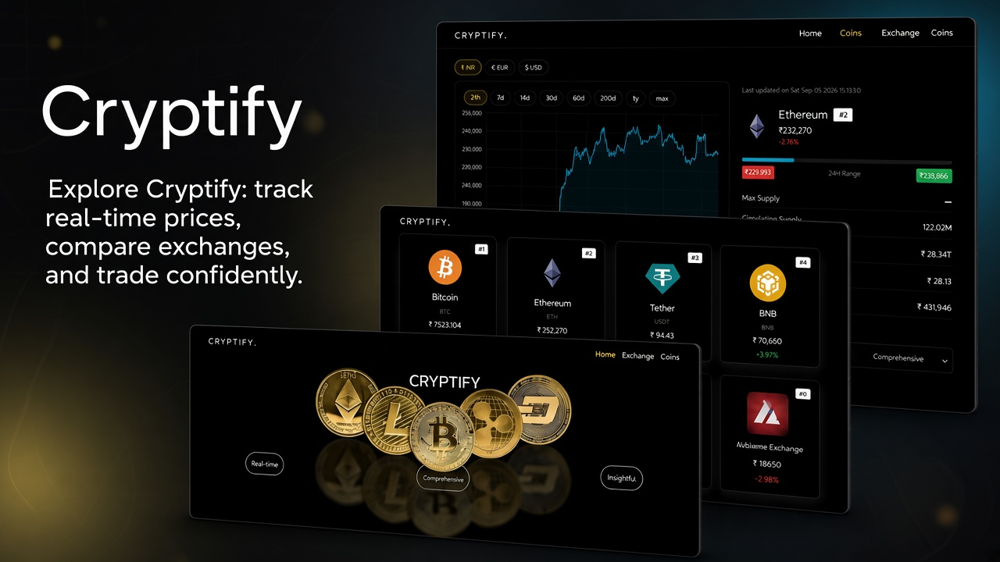
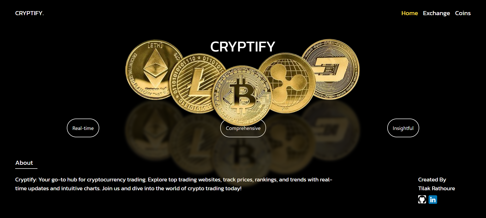
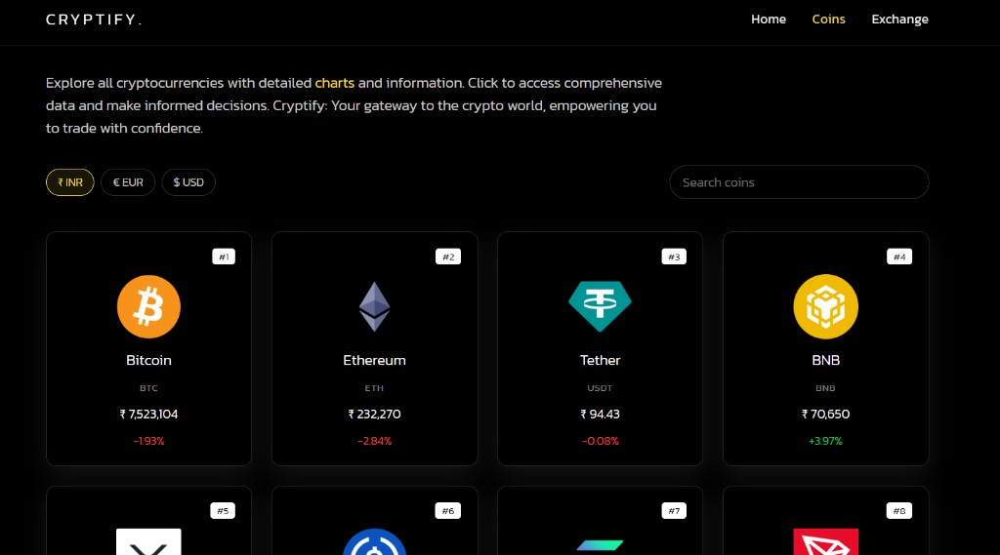
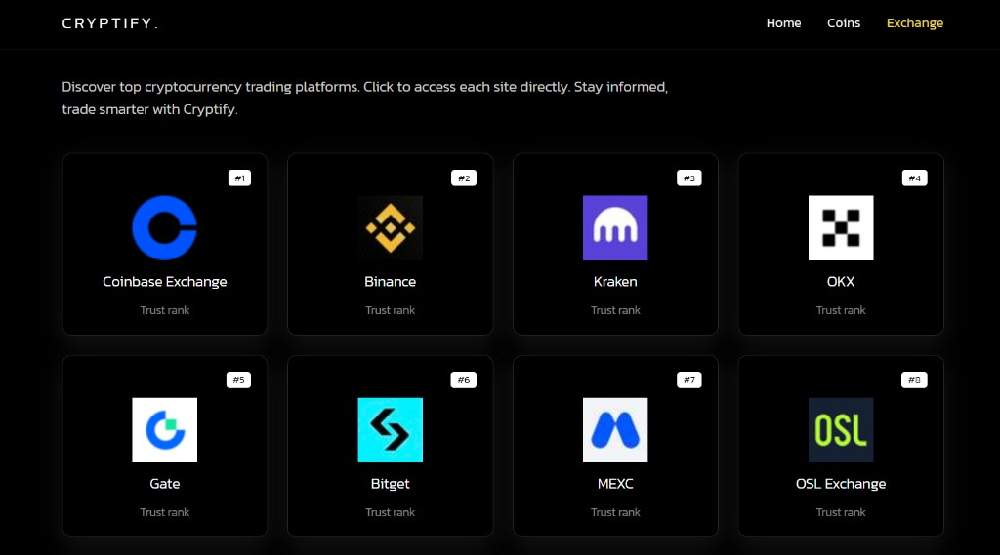
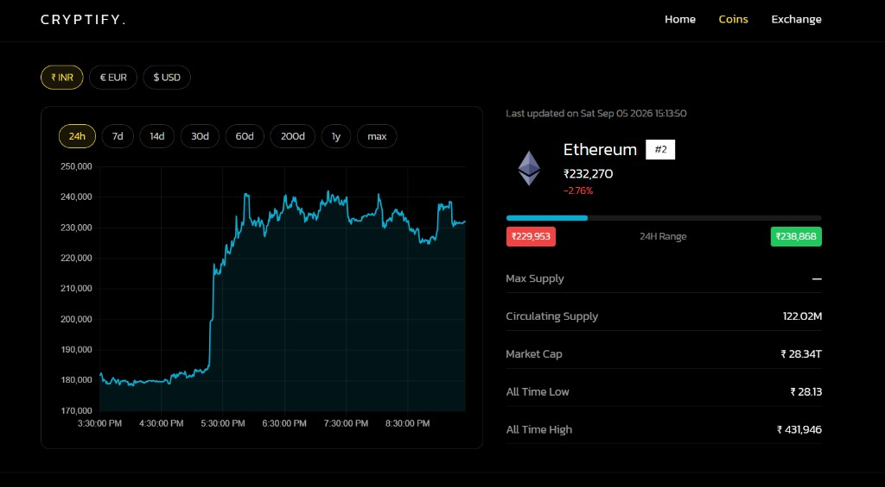

# Cryptify

Track cryptocurrency prices, charts, and top exchanges in one place. Data comes from the [CoinGecko API](https://www.coingecko.com/en/api).

## Preview











## Features

- Market list with search, pagination, and INR / EUR / USD prices
- Coin detail pages with historical charts and supply / market-cap stats
- Ranked exchange directory with links to each platform

## Stack

React 18, React Router, Tailwind CSS, Chart.js, Axios. Create React App for the toolchain.

## Setup

```bash
npm install
npm start
```

Open [http://localhost:3000](http://localhost:3000). Production build: `npm run build` (output in `build/`).

Deploy by importing the repo in Vercel; it should detect Create React App automatically.
